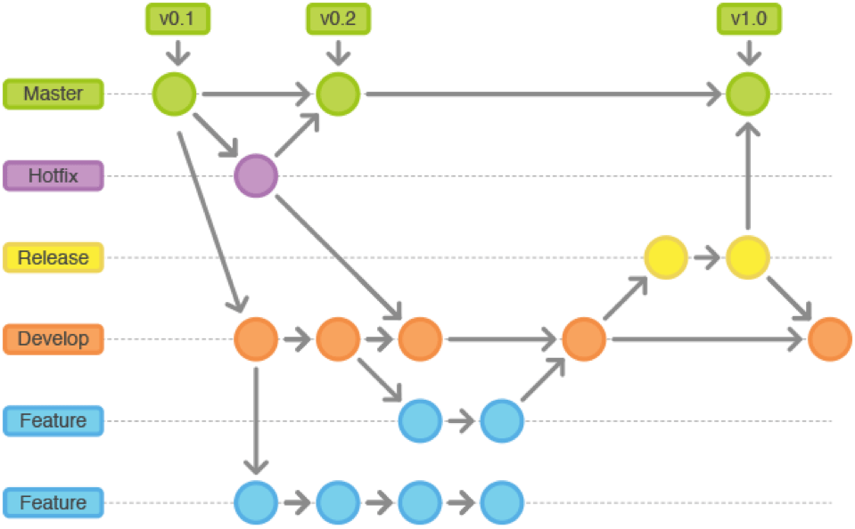

# 🧰 Git — Guía Completa

<p align="center">
  
</p>

> **Git** es el sistema de control de versiones distribuido de código abierto más usado del mundo. Te permite registrar el historial de cambios de tus proyectos, colaborar en equipo y revertir errores con facilidad.

---

## 📌 ¿Para qué sirve Git?

- Guardar "instantáneas" de tu código en cada momento importante.
- Trabajar en paralelo con otras personas sin pisarse el trabajo.
- Volver atrás en el tiempo si algo se rompe.
- Mantener distintas versiones del mismo proyecto (ramas).
- Sincronizar tu trabajo local con plataformas remotas como **GitHub**.

---

## 🛠️ Instalación

| Sistema | Enlace |
|---|---|
| Windows | https://windows.github.com |
| Mac | https://mac.github.com |
| Linux / POSIX | http://git-scm.com |

---

## ⚙️ Configuración inicial

Antes de nada, configura tu identidad. Solo necesitas hacerlo una vez.

```bash
# Establece tu nombre de usuario
git config --global user.name "Tu Nombre"

# Establece tu email
git config --global user.email "tuemail@ejemplo.com"

# Activa los colores en la terminal (muy útil)
git config --global color.ui auto
```

---

## 📁 Crear repositorios

```bash
# Crea un repositorio local nuevo
git init nombre-del-proyecto

# Clona un repositorio remoto existente (descarga todo el historial)
git clone https://url-del-repositorio.git
```

---

## 📸 Flujo básico: Efectuar cambios

El flujo habitual es: **modificar → preparar (stage) → confirmar (commit)**.

```bash
# Ver qué archivos han cambiado
git status

# Ver las diferencias que aún NO están en el área de espera
git diff

# Preparar un archivo para el commit (añadirlo al área de espera)
git add archivo.txt

# Ver las diferencias de lo que ya está en el área de espera
git diff --staged

# Sacar un archivo del área de espera (sin perder los cambios)
git reset archivo.txt

# Confirmar los cambios con un mensaje descriptivo
git commit -m "Mensaje descriptivo del cambio"
```

---

## 🌿 Ramas (Branches)

Las ramas te permiten trabajar en funcionalidades o experimentos sin tocar el código principal.

```bash
# Ver todas las ramas del repositorio
git branch

# Crear una nueva rama
git branch nombre-rama

# Cambiar a otra rama
git checkout nombre-rama

# Fusionar una rama con la rama actual
git merge nombre-rama

# Eliminar una rama (una vez fusionada)
git branch -d nombre-rama
```

---

## 🔍 Repasar el historial

```bash
# Ver el historial de commits de la rama actual
git log

# Ver el historial de un archivo concreto (incluye renombrados)
git log --follow archivo.txt

# Comparar diferencias entre dos ramas
git diff rama-A...rama-B

# Ver los detalles de un commit específico
git show abc1234
```

---

## 🔄 Sincronizar con el repositorio remoto

```bash
# Descargar todo el historial del remoto (sin fusionar)
git fetch origin

# Fusionar la rama remota con la local
git merge origin/main

# Subir tus commits al repositorio remoto
git push origin nombre-rama

# Descargar cambios del remoto e incorporarlos directamente
git pull
```

---

## 🗂️ Renombrar y eliminar archivos

```bash
# Eliminar un archivo del directorio Y prepararlo para el commit
git rm archivo.txt

# Dejar de rastrear un archivo pero conservarlo en local
git rm --cached archivo.txt

# Renombrar un archivo y prepararlo para el commit
git mv nombre-original.txt nombre-nuevo.txt
```

---

## 🧹 Suprimir tracking: el archivo `.gitignore`

Crea un archivo llamado `.gitignore` en la raíz del proyecto para excluir archivos que no quieres rastrear (logs, builds, temporales, etc.).

```
# Ejemplo de .gitignore

*.log          # Todos los archivos .log
build/         # La carpeta build entera
temp-*         # Cualquier archivo que empiece por "temp-"
```

```bash
# Ver todos los archivos ignorados en el proyecto
git ls-files --other --ignored --exclude-standard
```

---

## 💾 Guardar cambios temporales (Stash)

Útil cuando necesitas cambiar de rama sin hacer commit de algo que aún no está listo.

```bash
# Guardar temporalmente todos los cambios en progreso
git stash

# Ver todos los stashes guardados
git stash list

# Recuperar el stash más reciente
git stash pop

# Eliminar el stash más reciente sin recuperarlo
git stash drop
```

---

## ↩️ Deshacer y corregir — Guía completa

### 🔀 Comparativa rápida: ¿qué herramienta usar?

| Situación | Herramienta |
|---|---|
| Quitar archivos del stage sin perder cambios | `git restore --staged` |
| Descartar cambios en un archivo (sin commit) | `git restore` |
| Volver atrás N commits (solo en local) | `git reset` |
| Deshacer un commit publicado sin reescribir historial | `git revert` |
| Corregir el último commit (mensaje o archivos) | `git commit --amend` |
| Llevar un commit concreto a otra rama | `git cherry-pick` |
| Recuperar algo borrado o perdido | `git reflog` |

---

### 1. `git restore` — Descartar cambios sin commit

```bash
# Quitar un archivo del área de espera (stage) sin perder los cambios en disco
git restore --staged archivo.txt

# Quitar TODOS los archivos del stage de golpe
git restore --staged .

# Descartar los cambios de un archivo (vuelve al último commit) ⚠️ irreversible
git restore archivo.txt

# Descartar TODOS los cambios no commiteados ⚠️ irreversible
git restore .
```

> ⚠️ `git restore` sin `--staged` borra tus cambios locales definitivamente. No hay vuelta atrás.

---

### 2. `git reset` — Mover el puntero HEAD hacia atrás

`reset` reescribe el historial local. Tiene tres modos según qué pasa con tus cambios:

```
HEAD~1 = el commit anterior al actual
HEAD~3 = tres commits hacia atrás
abc1234 = un commit concreto por su hash
```

```bash
# --soft → deshace el commit, pero deja los cambios en el STAGE
git reset --soft HEAD~1
# Útil para: reescribir el último commit o dividirlo en varios

# --mixed (por defecto) → deshace el commit y saca los cambios del stage
#                         pero los conserva en el directorio de trabajo
git reset HEAD~1
git reset --mixed HEAD~1
# Útil para: deshacer commits y rehacer con otro agrupamiento

# --hard → deshace el commit y BORRA todos los cambios ⚠️ destructivo
git reset --hard HEAD~1
git reset --hard abc1234
# Útil para: limpiar por completo y volver a un estado anterior
```

**Resumen visual:**

```
                      --soft    --mixed   --hard
Commit deshecho         ✅         ✅        ✅
Cambios en stage        ✅         ❌        ❌
Cambios en disco        ✅         ✅        ❌
```

> ⚠️ Nunca uses `git reset` en commits que ya hayas publicado con `git push`. Reescribe el historial y causará conflictos a tus compañeros.

---

### 3. `git revert` — Deshacer un commit de forma segura

`revert` crea un **nuevo commit** que invierte los cambios de otro. No reescribe historial, por eso es seguro usarlo en ramas compartidas y en `main`.

```bash
# Revertir el último commit (crea un commit de reversión)
git revert HEAD

# Revertir un commit concreto por su hash
git revert abc1234

# Revertir sin abrir el editor (usa el mensaje por defecto)
git revert --no-edit abc1234

# Revertir varios commits a la vez (del más reciente al más antiguo)
git revert HEAD~3..HEAD

# Preparar la reversión sin hacer el commit todavía (para revisarla)
git revert --no-commit abc1234
git revert --no-commit def5678
git commit -m "revert: deshace features X e Y"
```

**Diferencia clave con reset:**

```
reset:  A → B → C         (borra C del historial)
revert: A → B → C → C'   (C' deshace lo que hizo C, historial intacto)
```

---

### 4. `git commit --amend` — Corregir el último commit

Solo para el commit más reciente. Si ya lo has pusheado, necesitarás un `push --force-with-lease`.

```bash
# Cambiar solo el mensaje del último commit
git commit --amend -m "Mensaje corregido"

# Añadir un archivo olvidado al último commit (sin cambiar el mensaje)
git add archivo-olvidado.txt
git commit --amend --no-edit

# Cambiar el mensaje Y añadir archivos (se abre el editor)
git add otro-archivo.txt
git commit --amend
```

---

### 5. `git cherry-pick` — Traer un commit concreto a otra rama

Útil para aplicar un fix puntual de una rama a otra sin fusionar todo.

```bash
# Llevar un commit concreto a la rama actual
git cherry-pick abc1234

# Llevar varios commits (en orden, del más antiguo al más reciente)
git cherry-pick abc1234 def5678 ghi9012

# Llevar un rango de commits
git cherry-pick abc1234..ghi9012

# Aplicar el commit pero sin hacer el commit todavía (para revisarlo)
git cherry-pick --no-commit abc1234

# Si hay conflictos durante el cherry-pick:
# 1. Resuelve los conflictos manualmente
git add archivo-con-conflicto.txt
# 2. Continúa
git cherry-pick --continue
# O aborta si prefieres cancelar
git cherry-pick --abort
```

**Caso de uso típico:**

```bash
# Tienes un hotfix en main que necesitas también en develop
git checkout develop
git cherry-pick abc1234   # el hash del commit del hotfix
```

---

### 6. `git reflog` — La red de seguridad definitiva

`reflog` guarda un registro de todos los movimientos de HEAD, incluso los borrados con `reset --hard`. Es tu salvavidas cuando crees que has perdido algo.

```bash
# Ver el historial completo de movimientos del HEAD
git reflog

# Salida de ejemplo:
# abc1234 HEAD@{0}: commit: feat: añade login
# def5678 HEAD@{1}: reset --hard: moving to def5678
# ghi9012 HEAD@{2}: commit: fix: corrige bug en pagos
# jkl3456 HEAD@{3}: checkout: moving from develop to feature/login

# Volver a un estado anterior por su posición en el reflog
git reset --hard HEAD@{2}

# O por su hash directamente
git reset --hard ghi9012
```

> 💡 `reflog` solo existe en tu repositorio local. Si borras el repo o el `.git`, se pierde.

---

### 🚨 Solución de errores típicos

#### ❌ "He modificado archivos que no quería"

```bash
# Ver qué ha cambiado
git status

# Descartar los cambios de un archivo concreto
git restore archivo.txt

# Descartar todos los cambios no commiteados
git restore .
```

---

#### ❌ "He añadido al stage un archivo que no quería"

```bash
# Quitar un archivo concreto del stage
git restore --staged archivo.txt

# Quitar todo del stage de golpe
git restore --staged .

# Alternativa más antigua (también funciona)
git reset HEAD archivo.txt
```

---

#### ❌ "He hecho commit con el mensaje equivocado"

```bash
# Si aún NO has pusheado:
git commit --amend -m "Mensaje correcto"

# Si YA has pusheado (fuerza el push con seguridad):
git commit --amend -m "Mensaje correcto"
git push --force-with-lease origin nombre-rama
```

---

#### ❌ "He olvidado añadir un archivo al último commit"

```bash
git add archivo-olvidado.txt
git commit --amend --no-edit

# Si ya habías pusheado:
git push --force-with-lease origin nombre-rama
```

---

#### ❌ "He hecho commit en la rama equivocada"

```bash
# 1. Copia el hash del commit que quieres mover
git log --oneline -5

# 2. Ve a la rama correcta y aplica el commit
git checkout rama-correcta
git cherry-pick abc1234

# 3. Vuelve a la rama equivocada y elimina el commit
git checkout rama-equivocada
git reset --hard HEAD~1
```

---

#### ❌ "He hecho push de algo que no debería"

```bash
# Opción segura: revertir el commit en remoto (sin reescribir historial)
git revert abc1234
git push origin nombre-rama

# Opción agresiva: solo si trabajas solo o todo el equipo lo sabe ⚠️
git reset --hard HEAD~1
git push --force-with-lease origin nombre-rama
```

> ⚠️ `push --force` sin `--lease` es peligroso: puede borrar commits de otros. Usa siempre `--force-with-lease`, que falla si alguien más ha pusheado mientras tanto.

---

#### ❌ "He hecho merge por error"

```bash
# Si aún NO has pusheado el merge:
git reset --hard HEAD~1

# Si YA has pusheado el merge:
git revert -m 1 HEAD    # -m 1 indica que conservas la rama base (main/develop)
git push origin nombre-rama
```

---

#### ❌ "He borrado una rama con trabajo sin mergear"

```bash
# 1. Busca el último commit de esa rama en el reflog
git reflog

# 2. Recrea la rama desde ese commit
git checkout -b nombre-rama abc1234
```

---

#### ❌ "Tengo conflictos en un merge y no sé cómo resolverlos"

```bash
# 1. Ver qué archivos tienen conflictos
git status

# 2. Los conflictos en el archivo se ven así:
# <<<<<<< HEAD
# tu versión actual
# =======
# versión que viene del merge
# >>>>>>> feature/nombre-rama

# 3. Edita el archivo manualmente, queda con lo que quieres y borra las marcas
# 4. Marca el archivo como resuelto
git add archivo-con-conflicto.txt

# 5. Finaliza el merge
git commit

# Si prefieres abortar el merge y volver al estado anterior:
git merge --abort
```

---

## 🗺️ Resumen visual del flujo

```
 Directorio de trabajo
        │
        │  git add
        ▼
   Área de espera (Stage)
        │
        │  git commit
        ▼
  Repositorio local
        │
        │  git push
        ▼
  Repositorio remoto (GitHub)
```

---

## 🌊 GitFlow — Metodología de trabajo en equipo

GitFlow es una estrategia de ramificación diseñada para proyectos con **ciclos de release definidos**. Establece roles claros para cada rama y un flujo de trabajo ordenado para todo el equipo.

---

### 🏗️ Las 5 ramas de GitFlow

| Rama | Tipo | Propósito |
|---|---|---|
| `main` | Permanente | Código en producción, siempre estable |
| `develop` | Permanente | Integración continua de nuevas features |
| `feature/*` | Temporal | Desarrollo de una funcionalidad concreta |
| `release/*` | Temporal | Preparación de una nueva versión |
| `hotfix/*` | Temporal | Corrección urgente en producción |

---

### 🗺️ Diagrama del flujo completo

<p align="center">
  
</p>

---

### 🚀 Instalación de git-flow (extensión oficial)

```bash
# macOS
brew install git-flow-avh

# Ubuntu / Debian
apt-get install git-flow

# Windows (Git Bash ya lo incluye en versiones recientes)
# Si no, descarga desde: https://github.com/petervanderdoes/gitflow-avh
```

---

### ⚙️ Inicializar GitFlow en un proyecto

```bash
# Dentro de tu repositorio, ejecuta:
git flow init

# Te preguntará los nombres de las ramas (acepta los valores por defecto):
# Branch for production releases: main
# Branch for "next release" development: develop
# Feature branches prefix: feature/
# Bugfix branches prefix: bugfix/
# Release branches prefix: release/
# Hotfix branches prefix: hotfix/
# Support branches prefix: support/
# Version tag prefix: v
```

---

### ✨ Features — Nuevas funcionalidades

Una feature es cualquier nueva funcionalidad que se desarrolla en aislamiento y luego se integra en `develop`.

```bash
# 1. Crear una nueva feature (se crea desde develop automáticamente)
git flow feature start nombre-feature
# Equivalente manual:
git checkout develop
git checkout -b feature/nombre-feature

# 2. Trabajar y hacer commits normalmente...
git add .
git commit -m "feat: añade formulario de login"

# 3. Finalizar la feature (merge a develop + borra la rama)
git flow feature finish nombre-feature
# Equivalente manual:
git checkout develop
git merge --no-ff feature/nombre-feature
git branch -d feature/nombre-feature

# 4. Subir una feature al remoto (para colaborar con otros)
git flow feature publish nombre-feature

# 5. Descargar una feature de otro compañero
git flow feature pull origin nombre-feature
```

> 💡 **Buenas prácticas en features:**
> - Una feature = una funcionalidad concreta y acotada.
> - Nunca hagas merge directo a `main`.
> - Mantén las features lo más cortas posible para evitar conflictos.

---

### 📦 Releases — Preparar una versión

Una release es la fase de estabilización antes de llegar a producción: se corrigen bugs menores, se actualiza la versión y se prepara la documentación.

```bash
# 1. Crear la release desde develop
git flow release start 1.2.0
# Equivalente manual:
git checkout develop
git checkout -b release/1.2.0

# 2. Hacer ajustes finales (bumps de versión, fixes menores, changelog...)
echo "1.2.0" > VERSION
git commit -am "chore: bump version to 1.2.0"

# 3. Finalizar la release:
#    - Merge a main (con tag de versión)
#    - Merge a develop (para que tenga los fixes)
#    - Borra la rama release
git flow release finish 1.2.0
# Se abrirá el editor para el mensaje del tag

# Equivalente manual:
git checkout main
git merge --no-ff release/1.2.0
git tag -a v1.2.0 -m "Release version 1.2.0"
git checkout develop
git merge --no-ff release/1.2.0
git branch -d release/1.2.0

# 4. Publicar los cambios y el tag
git push origin main
git push origin develop
git push origin --tags
```

> 💡 **Buenas prácticas en releases:**
> - No añadas nuevas funcionalidades en una rama release, solo correcciones.
> - Actualiza siempre el `CHANGELOG.md` antes de finalizar.
> - Usa versionado semántico: `MAJOR.MINOR.PATCH` (ej. `2.1.0`).

---

### 🚑 Hotfixes — Parches urgentes en producción

Un hotfix se crea directamente desde `main` para corregir un bug crítico en producción sin esperar al ciclo de release normal.

```bash
# 1. Crear el hotfix desde main
git flow hotfix start 1.2.1
# Equivalente manual:
git checkout main
git checkout -b hotfix/1.2.1

# 2. Corregir el bug y hacer commit
git add .
git commit -m "fix: corrige crash en el proceso de pago"

# 3. Finalizar el hotfix:
#    - Merge a main (con tag)
#    - Merge a develop (para no perder el fix)
#    - Borra la rama hotfix
git flow hotfix finish 1.2.1

# Equivalente manual:
git checkout main
git merge --no-ff hotfix/1.2.1
git tag -a v1.2.1 -m "Hotfix 1.2.1"
git checkout develop
git merge --no-ff hotfix/1.2.1
git branch -d hotfix/1.2.1

# 4. Publicar
git push origin main
git push origin develop
git push origin --tags
```

> ⚠️ **Importante:** Si hay una rama `release` activa cuando lanzas el hotfix, el merge debe ir a la release (en lugar de a develop) para que el fix quede incluido en el próximo lanzamiento.

---

### 🐛 Bugfixes — Correcciones durante el desarrollo

Los bugfixes se usan para corregir errores encontrados en `develop` (no en producción).

```bash
# Crear un bugfix
git flow bugfix start nombre-bug

# Finalizar el bugfix (merge a develop)
git flow bugfix finish nombre-bug
```

---

### 📋 Convención de mensajes de commit (Conventional Commits)

Adoptar una convención de mensajes hace el historial mucho más legible y facilita la generación automática de changelogs.

```
<tipo>(<alcance opcional>): <descripción corta>

Tipos más comunes:
  feat     → nueva funcionalidad
  fix      → corrección de bug
  docs     → cambios en documentación
  style    → formato, espacios (sin cambio de lógica)
  refactor → refactorización sin nueva funcionalidad ni fix
  test     → añadir o modificar tests
  chore    → tareas de mantenimiento (build, deps, etc.)
```

**Ejemplos:**

```bash
git commit -m "feat(auth): añade login con Google OAuth"
git commit -m "fix(carrito): corrige total incorrecto con cupones"
git commit -m "docs: actualiza README con sección de GitFlow"
git commit -m "chore: actualiza dependencias a versión LTS"
```

---

### 🔀 Merge vs Rebase en GitFlow

| | `merge --no-ff` | `rebase` |
|---|---|---|
| Historial | Preserva el historial real con nodos de merge | Historial lineal y limpio |
| Cuándo usarlo | Al integrar features/releases/hotfixes | Al actualizar tu feature con los últimos cambios de develop |
| Seguridad | Seguro en ramas compartidas | **Nunca en ramas compartidas** (reescribe historial) |

```bash
# Actualizar tu feature con los últimos cambios de develop (rebase local)
git checkout feature/mi-feature
git rebase develop

# Integrar feature a develop (siempre con --no-ff para preservar contexto)
git checkout develop
git merge --no-ff feature/mi-feature
```

---

### ✅ Resumen del ciclo GitFlow

```
1. git flow init                          → Configura el repositorio
2. git flow feature start nueva-func     → Empiezas a desarrollar
3. [commits de trabajo...]
4. git flow feature finish nueva-func    → Se integra en develop
5. git flow release start 1.0.0          → Preparas la versión
6. [ajustes finales, bump de versión...]
7. git flow release finish 1.0.0         → Se sube a main con tag
8. git push origin main develop --tags   → Publicas todo
```

---

## 📚 Recursos

- Documentación oficial: https://git-scm.com/doc
- GitHub Training: training@github.com / https://training.github.com
- Chuleta oficial de GitHub (en la que se basa esta guía): https://training.github.com/downloads/es_ES/github-git-cheat-sheet/

---

*Guía elaborada a partir de la Hoja de Referencia oficial de GitHub Git v1.1.1*
