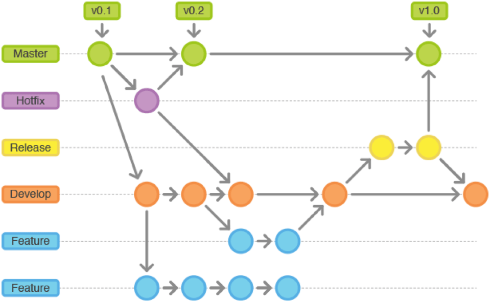

# GIT

<p align="center">
  
</p>

Git es un **sistema de control de versiones distribuido**, usado para registrar los cambios en el código fuente y facilitar el trabajo colaborativo entre desarrolladores.

---

## Organización del código fuente

### Creación de un repositorio local

Inicializa un nuevo repositorio en tu proyecto:

```bash
git init
```

Clona un repositorio existente desde GitHub o similar:

```bash
git clone https://github.com/usuario/repositorio.git
```

### Aprobación de cambios en consola

Flujo básico para registrar cambios:

```bash
git add archivo.txt          # Añade archivos al área de preparación
git commit -m "Mensaje del commit"  # Confirma los cambios
```

Agregar todos los cambios:

```bash
git add .
```

### Aprobación de cambios con interfaz gráfica

Puedes usar herramientas como **GitHub Desktop**, **VS Code**, **Sourcetree** o **Gitkraken** para hacer commits visualmente:

- Selecciona los archivos modificados  
- Escribe un mensaje descriptivo  
- Pulsa “Commit” o “Confirmar cambios”

### Trabajo en remoto

Conecta tu repositorio local con un remoto:

```bash
git remote add origin https://github.com/usuario/repositorio.git
git push -u origin main
```

Traer los últimos cambios:

```bash
git pull origin main
```

### Deshaciendo cambios

Revertir un archivo a su último estado confirmado:

```bash
git checkout -- archivo.txt
```

Deshacer el último commit (sin perder cambios locales):

```bash
git reset --soft HEAD~1
```

Deshacer completamente (perdiendo los cambios):

```bash
git reset --hard HEAD~1
```

### Resolviendo conflictos

Cuando Git no puede fusionar automáticamente:

1. Edita los archivos conflictivos (Git marca las secciones en conflicto)

2. Luego:

```bash
git add archivo.txt
git commit -m "Conflictos resueltos"
```

### Subiendo cambios

Envía los commits locales al repositorio remoto:

```bash
git push origin main
```

## Flujos de trabajo

### Encontrando errores

Muestra el historial de cambios:

```bash
git log
```

Ver quién modificó cada línea:

```bash
git blame archivo.txt
```

### Git Blame

Ejemplo:

```bash
git blame script.js
```

Muestra autor, fecha y hash del commit por cada línea. Muy útil para auditorías o depuración.

### Estrategia Merge

Fusiona ramas:

```bash
git checkout main
git merge nueva-rama
```

Crea un nuevo commit que une las dos historias.

### Estrategia Rebase

Reaplica commits sobre otra rama:

```bash
git checkout nueva-rama
git rebase main
```

El historial queda más lineal y limpio.

### Estrategia Merge Squash - Rebase

Combina varios commits en uno solo antes de fusionar:

```bash
git merge --squash nueva-rama
git commit -m "Resumen de cambios"
```

### Git Stash

Guarda temporalmente cambios no confirmados:

```bash
git stash           # Guarda cambios
git stash pop       # Recupera los cambios
```

### Saltando entre commits

Cambia el estado del repositorio a un commit específico:

```bash
git checkout <hash_del_commit>
```

Para volver a la rama principal:

```bash
git checkout main
```

## Trabajo colaborativo

### Etiquetas

Marca versiones específicas del proyecto:

```bash
git tag -a v1.0 -m "Versión inicial"
git push origin v1.0
```

### Releases

Las *releases* son versiones publicadas, normalmente vinculadas a una etiqueta.  
En GitHub puedes crearlas desde la interfaz gráfica, seleccionando un tag y añadiendo notas de la versión.

### Issues

Sirven para reportar errores o solicitar nuevas funciones.  
En GitHub:

- “New Issue” → describe el problema  
- Etiqueta y asigna responsables

### Pull Requests (PR)

Permiten revisar y fusionar cambios antes de integrarlos a la rama principal.

Desde consola:

```bash
git push origin nueva-rama
```

Luego, crea el Pull Request desde la plataforma (GitHub, GitLab, etc.).

### Integración continua (CI)

Automatiza pruebas y despliegues cuando se suben cambios.  
Ejemplo con **GitHub Actions** (`.github/workflows/test.yml`):

```yaml
name: CI
on: [push]
jobs:
  build:
    runs-on: ubuntu-latest
    steps:
      - uses: actions/checkout@v3
      - name: Ejecutar tests
        run: npm test
```

## Solución de errores comunes en Git

### Commit no deseado

Si hiciste un commit que no querías:

```bash
git reset --soft HEAD~1
```

Esto deshace el último commit pero mantiene tus cambios en el área de trabajo.

Si quieres eliminarlo completamente:

```bash
git reset --hard HEAD~1
```

### Push no deseado

Si subiste cambios erróneos al remoto:

```bash
git push origin main --force
```

**Cuidado:** Esto sobrescribe el historial remoto. Úsalo solo si nadie más ha trabajado sobre esa rama.

Alternativa más segura: revertir el commit sin borrar el historial.

```bash
git revert <hash_del_commit>
git push origin main
```

### Conflictos al hacer merge o rebase

Cuando Git no puede unir ramas automáticamente:

1. Abre los archivos marcados con `<<<<<<<`, `=======`, `>>>>>>>`
2. Elimina los marcadores y conserva la versión correcta
3. Luego:

```bash
git add archivo.txt
git rebase --continue  # o git merge --continue
```

### Error: "fatal: not a git repository"

Esto ocurre si ejecutas comandos fuera de un repositorio. Solución:

- Asegúrate de estar en el directorio correcto
- Inicializa el repositorio:

```bash
git init
```

### Recuperar archivos borrados por accidente

```bash
git checkout HEAD -- archivo.txt
```

## Gitflow

**Git Flow** es una estrategia de ramificación que organiza el flujo de trabajo en proyectos colaborativos, es ideal para proyectos con ciclos de versión claros y equipos medianos o grandes.

---

## Estructura principal de ramas

- **main** o **master** → contiene el código estable y listo para producción.  
- **develop** → rama de desarrollo; base para integrar nuevas funcionalidades.  
- **feature/** → ramas para desarrollar nuevas características.  
- **release/** → ramas preparatorias para nuevas versiones.  
- **hotfix/** → ramas para corregir errores críticos en producción.

## Flujo de trabajo básico

1. Crear una nueva rama de feature desde develop:

   ```bash
   git checkout develop
   git checkout -b feature/nueva-funcionalidad
   ```

2. Al terminar la feature, fusionarla con develop:

   ```bash
   git checkout develop
   git merge --no-ff feature/nueva-funcionalidad
   git branch -d feature/nueva-funcionalidad
   ```

3. Preparar una versión de release:

   ```bash
   git checkout -b release/1.0 develop
   ```

4. Fusionar la release con main y crear un tag:

   ```bash
   git checkout main
   git merge --no-ff release/1.0
   git tag -a v1.0 -m "Versión 1.0"
   ```

5. Fusionar también la release con develop para mantener sincronía:

   ```bash
   git checkout develop
   git merge --no-ff release/1.0
   ```

6. Si hay un error urgente en producción, crear una rama hotfix desde main:

   ```bash
   git checkout main
   git checkout -b hotfix/1.0.1
   ```

7. Al finalizar el hotfix, fusionar en main y develop:

   ```bash
   git checkout main
   git merge --no-ff hotfix/1.0.1
   git checkout develop
   git merge --no-ff hotfix/1.0.1
   ```

## Visionado Ramas Gitflow


